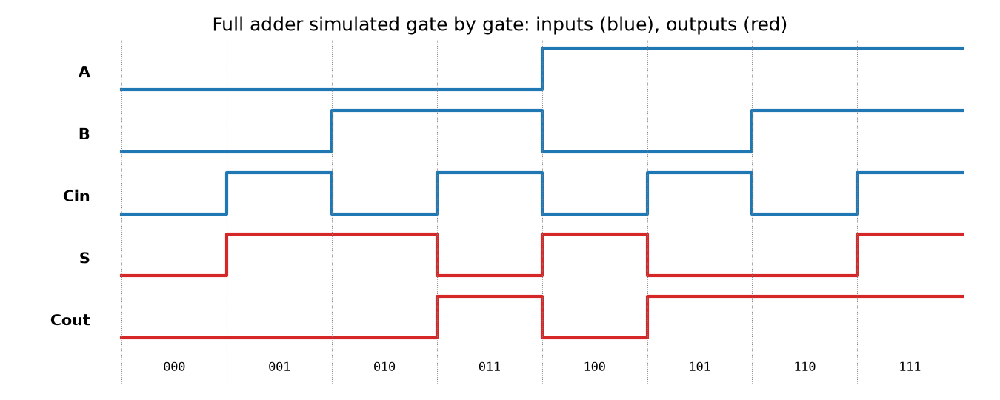

# logickit: Boolean Algebra and Digital Logic Toolkit


A dependency-free Python toolkit for combinational logic design: parse Boolean expressions written in textbook notation, generate truth tables, derive canonical forms, minimise functions with the Quine-McCluskey method (including don't-care terms), and simulate gate-level circuits such as adders and multiplexers.

It covers the *Circuits Logiques* (digital logic) course of an L2 Computer Science and AI program and the digital electronics part of a general electronics curriculum, and doubles as a checking tool for exercises done by hand with Karnaugh maps.

## Features

- **Expression parser** accepting the notations used in courses and datasheets: `A.B + C'`, `AB' + C`, `!A & B`, `(A XOR B) AND C`
- **Truth tables** in binary counting order, rendered as plain text
- **Canonical forms**: sum of minterms and product of maxterms
- **Minimisation**: Quine-McCluskey prime implicants, essential prime selection, then Petrick's method for an optimal cover; don't-care terms supported
- **Gate-level simulation** of acyclic netlists with AND, OR, NOT, NAND, NOR, XOR, XNOR and buffers, with detection of undriven wires and combinational loops
- **Reference circuits**: half adder, full adder, n-bit ripple-carry adder, 2-to-1 multiplexer
- **Command-line interface**

## Installation

Install the latest version directly from GitHub:

```bash
pip install "git+https://github.com/GUELORD-MWENDERWA/logic-circuit-toolkit.git"
```

Or download the wheel from the [latest release](https://github.com/GUELORD-MWENDERWA/logic-circuit-toolkit/releases/latest) and run `pip install logickit-0.1.0-py3-none-any.whl`.

For development:

```bash
git clone https://github.com/GUELORD-MWENDERWA/logic-circuit-toolkit.git
cd logic-circuit-toolkit
pip install -e ".[dev]"
```

## Command line

```console
$ logickit minimize "A'B'C + A'BC + AB'C + ABC"
variables : A, B, C
minterms  : [1, 3, 5, 7]
canonical : A'.B'.C + A'.B.C + A.B'.C + A.B.C
POS       : (A + B + C).(A + B' + C).(A' + B + C).(A' + B' + C)
minimal   : C

$ logickit table "AB + C'"
A B C | F
---------
0 0 0 | 1
0 0 1 | 0
...

$ logickit minterms 4 5,6,7,8,9 --dc 10,11,12,13,14,15
B.D + B.C + A
```

The last example designs a "BCD digit greater than 4" detector, using the six invalid BCD codes as don't-cares.

## Results

The figures below are produced by the library itself. Regenerate them with `pip install matplotlib && python docs/make_figures.py`.



*Full adder simulated gate by gate over all eight input combinations*

## Library

```python
from logickit import parse, minimize, ripple_carry_adder

minimize("A.B + A'.C + B.C")      # "A'.C + A.B" (consensus term removed)

adder = ripple_carry_adder(4)
inputs = {f"A{i}": (9 >> i) & 1 for i in range(4)} | {f"B{i}": (5 >> i) & 1 for i in range(4)} | {"Cin": 0}
adder.simulate(inputs)             # S0..S3 and Cout encode 14
adder.gate_count()                 # {'XOR': 8, 'AND': 8, 'OR': 4}
```

## Notation

| Operation | Accepted syntax | Precedence |
| --- | --- | --- |
| NOT | `A'`, `!A`, `~A`, `NOT A` | highest |
| AND | `A.B`, `A*B`, `A&B`, `A AND B`, `AB` | |
| XOR | `A^B`, `A XOR B` | |
| OR | `A+B`, `A|B`, `A OR B` | lowest |

Variables are a single letter optionally followed by digits (`A`, `x1`, `D10`), which makes juxtaposition (`AB'C`) unambiguous.

## Testing

```bash
pytest
```

Tests check the parser, minimisation against known textbook results, that every minimised expression has exactly the original minterms, and exhaustive simulation of the adders (all 256 input pairs for the 4-bit adder).

## Roadmap

- Karnaugh map rendering for 2 to 4 variables
- Sequential elements (D and JK flip-flops) and counter simulation
- Export of a netlist to Verilog

## License

MIT. See [LICENSE](LICENSE).
